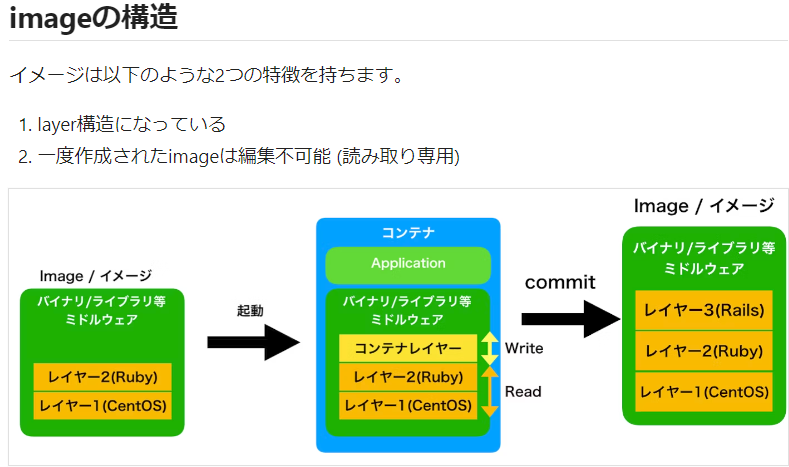
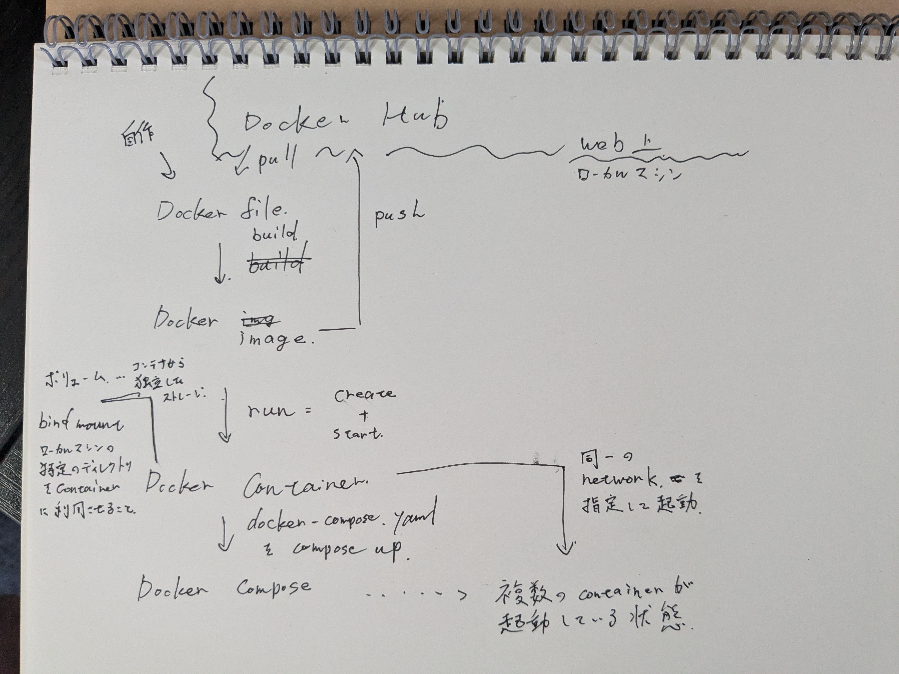

# Docker
# tutorial
 [https://docs.docker.jp/get-started/08_using_compose.html](https://docs.docker.jp/get-started/08_using_compose.html)
# コンテナとは

- 仮想化
    - ホスト型
        - ホストOS-ゲストOS形式
    - コンテナ型
        - ホストOS-Docker Engine形式
        - 比較的軽量で動作する

# Dockerコンテナができるまでの関係者

- Dockerコンテナ
    - 実際にアプリケーションを実行する環境
    - Docker imageをインスタンス化(`docker run`)したもの
- Docker image
    - コンテナの設計図のようなイメージ
    - DockerFileを`docker build`することで生成される
    - 複数のレイヤーから構成される特別なファイル
    
    
    
- DockerFile
    - Docker imageの設計図のイメージ
    - 具体的には各レイヤーの構成が手続き形式で書いてある
        
        > 各命令（例えば `RUN`, `COPY`, `ADD` など）はイメージの新しいレイヤーを作成します。

- 全体の関係性

  
## メモ | [https://docs.docker.jp/get-started/08_using_compose.html](https://docs.docker.jp/get-started/08_using_compose.html)

docker compose 

> デフォルトでは、 Docker Compose はアプリケーション スタックに指定したネットワークを自動的に作成します（そのため、 compose ファイル内にネットワークを定義しませんでした）。
> 

bind mount | https://qiita.com/etaroid/items/88ec3a0e2d80d7cdf87a

> bind mountでは、もしホスト上の空のディレクトリをコンテナ上の/userなどにマウントしたりした場合は、コンテナ上のデータが消えてしまい、コンテナがまともに動作しなくなることもあるので注意が必要です。
> 

Docker network

> つまり、Network指定をせずに起動したコンテナ同士は、IPアドレス指定で通信することは可能だが、コンテナ名指定で通信することはできないということです。
> 

## ハマったとこ

`docker run -dp 127.0.0.1:3000:3000 getting-started` とすべきコマンドを

`docker run -dp 127.0.0.1:3000:3000 getting-started .` で実行。Terminalでエラーが出ずに コンテナのログにPermission deniedのエラーがでた