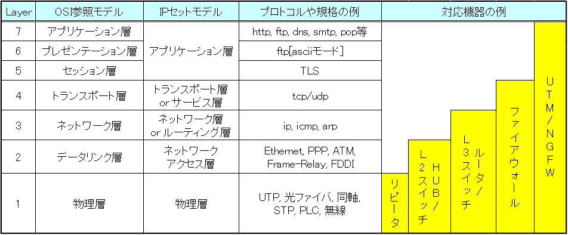
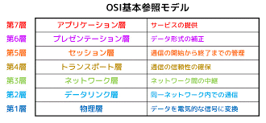
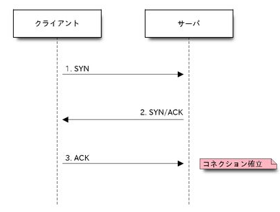

## 基礎知識
- OSI参照モデル
  - IP｜ネットワーク層
  - TCP｜トランスポート層
  - ethanet｜データリンク層
  - 
  - 

- ルーティング
  - パケットはルータを通して目的地まで届けられる
  - ホップ数｜通過するルータ数
  - ルーティングテーブル｜次にパケットを渡す相手を記載している表
    - パケットの宛先、次にパケットを渡す相手（ネクストホップ）が対応するように記載
    - パケットの宛先が“default”には、ほかの宛先に当てはまらない場合に使用されるネクストホップを記載

## イーサネット

- IPのパケットが荷物の入ったダンボールだとすれば、イーサネットのフレームはトラックです。イーサネットでは、荷物の発着地と目的地をMACアドレスという識別子で管理します。
- フレーム｜イーサネットでデータを送る単位
- MACアドレスを使って宛先を特定する
  - ARPを使ってIPアドレスからMACアドレスを取得
    - ブロードキャストアドレスに対してARPリクエストを投げることで、IPアドレスを持っている機器がMACアドレスを返信してくれる
    - IPv6の場合はARPの代わりにNeighbor Discoveryを使用
- 戻りのルートは、フレームごとにMACアドレスとIPアドレスの対応関係がキャッシュされているため、ARPによる探索不要
- ブリッジとは
  - 自身のどのポートにどのMACアドレスの機器がつながっているのか管理する
    - ルータ｜ネットワーク層でパケットを転送する機器
    - ブリッジ｜データリンク層でフレームを転送する機器

## トランスポート層のプロトコル
>インターネットをより実用的に扱うには、いくつかの課題がまだ残されています。まず、はじめに問題となるのは、①コンピュータが扱う通信の内容には色々な種類がある点です。たとえば、皆さんはWebブラウジングをすることもすれば、メールを送受信することもあるでしょう。コンピュータでは、さまざまなアプリケーションの通信が、ごちゃごちゃに混ざってやり取りされます。送受信するたくさんのパケットが、それぞれどのアプリケーションで使われているものなのか、どうやって判断すれば良いのでしょうか。これは、IPのヘッダに含まれる情報だけではわかりません。  

>また、②パケットが経路上で破棄される恐れがある点も問題です。前述したとおり、インターネットではパケットが宛先まで届く前に勝手に捨てられてしまうことがあります。これはまるで、童謡の「やぎさんゆうびん」です。送った手紙は、読まれる前にヤギさんが食べてしまいます。しかも、インターネットの世界では、送った相手の黒ヤギさんが食べる以前に、配達する郵便局のヤギさんが勝手に食べてしまうのです。これでは、黒ヤギさんは白ヤギさんが手紙を出したかどうかすらわかりません。

>そのような状態で、相手と意思疎通をはかろうとするのは、なかなか大変でしょう。上記のような問題は、プロトコルの階層構造でIPのさらに上位に位置するプロトコルで解決します。
-  ポートを使用して通信するアプリケーションを区別する
   -  ヘッダに送信元のポートと送信先のポートが記載される
   - 送信元のポート番号の指定
     - サーバ時｜上位層のプロトコルによって固定されている（ex. DNS＝53）
     - クライアント時｜OSが自動的に割り当てる＝エフェメラルポート
   - 送信先のポート番号の指定
     - サーバ時｜クライアントからの送信元ポート番号を指定
     - クライアント時｜相手のアプリケーションによって固定されているポート番号を指定
## UDP
>UDPは、コネクションレス型という、送ったら送りっぱなしのプロトコルになっています。そのため、経路上でパケットが破棄されても、UDPは何も関知しません。もしもUDPを使って信頼性のある通信を実現したいときは、さらに上位層のプロトコルを使って対処する必要があります。
## TCP
>TCPはUDPと違って、送ったら送りっぱなしのプロトコルではありません。データが相手までちゃんと届いたことを確認しながら通信を進めます。その性質から、コネクション型のプロトコルと呼ばれます。もし、パケットが経路上で破棄されるなどして相手に届かなかったときは、同じデータを再び送ります。この仕組みは再送制御と呼ばれています。また、パケットは経路上で破棄される以外にも、送った順番と到着する順番が入れかわることもあります。この現象は、アウトオブオーダーと呼ばれます。TCPでは、アウトオブオーダーが生じたときも、データの順番を正しく認識して通信できます。

>TCPでは通信をはじめるときに3つのセグメントをやり取りします。目的は、通信する相手と、これからデータを送りあうことについて、あらかじめお互いに確認することです。この特徴的なTCPの通信は「スリーウェイハンドシェイク(threewayhandshake)」といいます。これは、人間でいえばこれから会話を始める相手と、お互いに挨拶と握手を交わしている状態です。スリーウェイハンドシェイクが完了すると、TCPのコネクションが確立したと見なされます。

## 参考書籍

- [Linuxで動かしながら学ぶTCP/IPネットワーク入門](https://www.amazon.co.jp/Linux%E3%81%A7%E5%8B%95%E3%81%8B%E3%81%97%E3%81%AA%E3%81%8C%E3%82%89%E5%AD%A6%E3%81%B6TCP-IP%E3%83%8D%E3%83%83%E3%83%88%E3%83%AF%E3%83%BC%E3%82%AF%E5%85%A5%E9%96%80-%E3%82%82%E3%81%BF%E3%81%98%E3%81%82%E3%82%81-ebook/dp/B085BG8CH5)