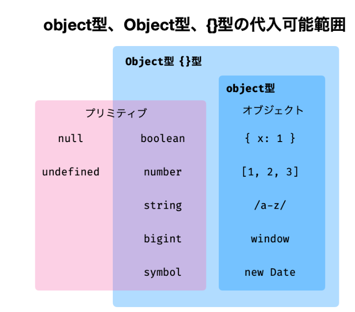

# 参考
https://typescriptbook.jp/reference/values-types-variables/let-and-const


# 値・型・変数

```TypeScript
const obj = {a:1}
obj.a=2 // プロパティの変更はできる

let obj2 = {a:1}
obj2 = {a:2} //letなら代入可能
```
- 型推論と動的型付けの違い
  - JS:動的型付け | 途中で型の変更が可能
```JavaScript
let x= 1
x = "hello"
```

  - TS:静的型付け＋型推論
 ```TypeScript
let x= 1
x = "hello"//xはnumberなので代入不可
```

- データ型  
  - プリミティブ型
    - ミュータブルでプロパティを持たない
    -  boolean, number, string, undefined, null, symbol, bigint
  - オブジェクト
    - それ以外は全部オブジェクト
### number型


```TypeScript
(5).tosString() //数値リテラルのプロパティを直接参照可能

// NaN判定
const price = ParceInt("百円")
if(Number.isNan(price)){
    console.log("error")
}
```
### stirng型
```TypeScript
if("a" === 'a' &&"a" === `a`){
    console.log("good")
}
```
- 名前がよく似た型にString型がありますが、stringとは異なる


```TypeScript
//undefinedは未定義を表すプリミティブな値
let name;
console.log(name);
//undefined
```
- undefinedとnullの違い
  - ニュアンスは、代入されていない vs 代入すべき値が存在しない
  - nullは自然発生しない
>特にこだわりがないのなら、TypeScriptではnullは使わずにundefinedをもっぱら使うようにするのがお勧めです。

### プリミティブ型
- プリミティブ型に対応するラッパーオブジェクトがある  
    - ボックス化とはプリミティブをオブジェクトに変換すること
    - JavaScriptでプリミティブがオブジェクトのように扱えるのは、自動ボックス化のおかげ

|プリミティブ型| ラッパーオブジェクト|
|-|-|
|boolean|	Boolean|
|number|	Number|
|stirng|	String|

```TypeScript
const str:string = "Hello_World"
console.log(str.length)
//stringはプリミティブ型なのにStringオブジェクトのプロパティ(length)にアクセスできる
```

### リテラル型

- 特定の値だけを代入可能にする型
- マジックナンバーやステートの表現に用いられます。その際、ユニオン型と組み合わせることが多いです。

```TypeScript
let num: 1 | 2 | 3 = 1;
```

### オブジェクト

```TypeScript
//クラス定義がなくてもこのようにオブジェクトリテラルを書くと、オブジェクトをインラインで作れます。

// オブジェクトの場合はインスタンスの一致を比較している
const obj1 = {a:1}
const obj2 = {a:1}
console.log(obj1==obj2)
//false
```

- メソッドとは、オブジェクトに関連づいた関数のこと
- オブジェクトの定義方法

```TypeScript
const obj= {
    name_property:"john",
    age_property:20,
    func_method:function (num:number){
        return num +1
    }
};
console.log(obj.func_function(1))

//型を指定したい場合
let obj2: {
    name_property:string;
    age_property:number;
    func_function(num:number):number;
}
const func = (num:number) => num +1
obj2 = {name_property:"john", age_property:20, func_function:func}
// 型エイリアスを使って型を指定するパターン
type obj_alias  = {
    name_property:string;
    age_property:number;
    func_function:(num:number)=>number//関数構文の書き方でも可能
}
const obj3:obj_alias = {name_property:"john", age_property:20,func_function:func}
```
### readonlyとconstの違い
- constは変数自体を代入不可するものです。変数がオブジェクトの場合、プロパティへの代入は許可されます。一方、readonlyはプロパティを代入不可にするものです。

```TypeScript

const x = { y: 1 };
x = { y: 2 }; // 変数そのものへの代入は不可
x.y = 2; // プロパティへの代入は許可


let obj: { readonly x: number } = { x: 1 };
obj.x = 2; //Cannot assign to 'x' because it is a read-only property.プロパティへの代入は不可
let obj: { readonly x: number } = { x: 1 };
obj = { x: 2 }; // 数そのものへの代入は許可される
```


### オプショナルチェーン (optional chaining)
- nullやundefinedでないかチェックを省略できる
  - TypeScriptでオプショナルチェーンを使った場合、得られる値の型は、最後のプロパティの型とundefinedのユニオン型になります。
  - オプショナルチェーンがundefinedを返したときに、デフォルト値を代入したい場合があります。その際には、Null合体演算子??を用いると便利です。
```TypeScript

const book = undefined;
// これが
let title = book === undefined || book === null? undefined: book.title
console.log(title);
// こうできる
title = book?.title;
//                ^^オプショナルチェーン
console.log(title);
// Null合体演算子(??)でさらに対応
title = book?.title ?? "undefinedの時に代入されるデフォルトタイトル"
console.log(title);
```
ここから
https://typescriptbook.jp/reference/values-types-variables/array

```TypeScript
```
```TypeScript
```

```TypeScript
```
```TypeScript
```
```TypeScript
```
```TypeScript
```
```TypeScript
```
- https://qiita.com/drken/items/fd4e5e3630d0f5859067#%E7%AC%AC-1-%E5%95%8F--abc-086-a---product-100-%E7%82%B9
```TypeScript
import {readFileSync} from 'fs'

const input = readFileSync("/dev/stdin", "utf8").split(" ");
const num_array:number[] = input.map(parseInt)
const res = num_array[0] * num_array[1]
let message: "Even"|"Odd" = "Even"
if(res%2 !== 0){
    message = "Odd"
}
console.log(message)
```
```TypeScript
// import {readFileSync} from 'fs'

// const input: string[] = readFileSync("/dev/stdin", "utf8").split(" ");
const input = ["101"]
const array_str:string[] = Array.from(input[0])
let counter = 0
array_str.map((value) => {
    if(value === "1") {
        counter++
    }
}) 
console.log(counter)
```
```TypeScript
// import {readFileSync} from 'fs'
// const input: string[] = readFileSync("/dev/stdin", "utf8").split(" ");

//1べた書き 
const input: number[] = [16, 256, 24]
let counter:number = 0
let test_array:number[] =input 
while(true){
    //　判定
    const judgement:boolean[] = test_array.map((value) =>  {
        return value%2==0? true:false
        })
    if(judgement.includes(false)){
        break
    }
    //　実行、カウントアップ
    test_array = test_array.map((value) => value/2))
    counter++

}
console.log(counter)
 

//2 メソッド分割

const isEven = (num:number) => {
    return num%2 == 0
}
const isAllEven = (numArray:number[])=>{
    const judgeArray:boolean[] =numArray.map(isEven)
    const ret = judgeArray.every((val)=> val)
    return ret
}

while(true){
    if(!isAllEven(test_array)) break;
    test_array = test_array.map((val)=>val/2)    
    counter++
}
console.log(counter)

//3 高階関数を使って記述量減少を狙った

while(true){
    const judge = test_array.every((val)=> val%2==0)
    if(!judge) break;
    test_array = test_array.map((val)=>val/2)    
    counter++
}
console.log(counter)

```
```TypeScript
const input: number[] = [3, 5, 3, 1500]
let counter:number = 0
const coin = {
    a:500,
    b:100,
    c:50,
}

const target = input[3]
for(let a_i=0; a_i<=input[0];a_i++){
    for(let b_i=0;b_i<=input[1];b_i++){
        for(let c_i=0;c_i<=input[2];c_i++){
            const sum =coin.a * a_i +  coin.b * b_i  + coin.c * c_i 
            
            if(sum === target){
                console.log(a_i, b_i, c_i)
                counter++
            }
        }
    }
}
console.log(counter)
```
```TypeScript
const input: number[] = [100, 3, 5]
const N = input[0]
const A = input[1]
const B = input[2]

let sumAll = 0
for(let i:number=0;i<=N; i++){
    const i_str = i.toString()
    console.log(i_str)
    const i_array_str = Array.from(i_str)
    console.log(i_array_str)
    console.log(i_array_str.map((val)=>typeof(val)))
    // const i_array_int = i_array_str.map(parseInt) //これだとなぜかキャストできない
    const i_array_int = i_array_str.map(Number)
    console.log(i_array_int)

    const sum = i_array_int.reduce((acc, cur) => acc+cur)
    // console.log(sum)

    if(A<=sum && sum<= B) sumAll += sum
}
console.log(sumAll)
```
```TypeScript

//1.べた書き
const input: number[] = [1,2,3,4,5,5,7,78,8,9, 3, 5]

const sorted = input.sort((a,b) => b-a)
let alice: number[] = []
let bob: number[]= []
for(let i= 0;i <sorted.length;i++){
    if(i%2==0) alice = alice.concat(sorted.slice(i, i+1))
    else bob =  bob.concat(sorted.slice(i, i+1))
}
const alice_sum = alice.reduce((acc,cur) => acc+cur)
const bob_sum = bob.reduce((acc,cur) => acc+cur)

console.log(alice_sum)
console.log(bob_sum)
console.log(alice_sum- bob_sum)

//2. Object.ettries()を使って記述量を削減
const sorted:number[] = input.sort((a,b) => b-a)
let alice: number = 0
let bob: number= 0
for(const [k, v] of sorted.entries())
    if(k%2==0) alice += v
    else bob =  bob+= v
}
console.log(alice- bob)
```
```TypeScript
```
```TypeScript
```
```TypeScript
```
```TypeScript
```
```TypeScript
```
```TypeScript
```
```TypeScript
```
```TypeScript
```

